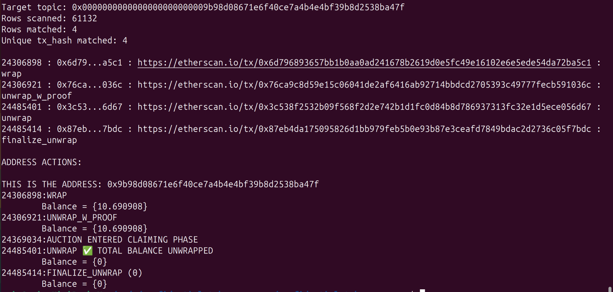

# Confidential Token Scanner

This repo's purpose is to attempt to trace ERC7984 tokens on Ethereum. It is mostly composed of scanners, databases, and scripts I'll call "parsers".

- **Scanners:** These scripts exist to find transactions involving ERC7984 tokens on Ethereum, and place them into the databases. They also may read from the databases and query for more information on the blockchain, or further classify information about the transactions. In general, _scanners add to the datatabases_
- **Databases:** These are SQL databases that contain transaction information for the different ERC7984's. Each token gets its own separate `.db` file. Right now within the databases, there are two tables, one of which is still under construction. The first table contains all _transactions_ involving the token in question. The second table contains all _handles_ (ZAMA fhEVM encrypted values) associated with that token. This is still under construction, but the goal is to be able to reason about handles' interconnections and parse their values without needing the transaction data.
- **Parsers:** These are scripts that read from the databases and display information in a human readable format. For example, `analyze-address.js` will show all transactions involving some address, in order, and attempt to deduce the balance of that address at each moment in time given basic logical rules.

**Further work:** Right now the next stage of this project is to flesh out the "handles" table within the databases and begin constructing "algebraic representations" of the various handles. 

  
### Setup

1. This is a hardhat project, so make sure you have hardhat installed.

2. You'll need to make a file called `hardhat.config.js` in the root directory. For that file, paste this in:

```
require("@nomicfoundation/hardhat-toolbox");

/** @type import('hardhat/config').HardhatUserConfig */
module.exports = {
  solidity: "0.8.24",
};

const privateKey = "0x0123567890abcdef0123567890abcdef0123567890abcdef0123567890abcdef";

module.exports = {
  defaultNetwork : "ethereum",  //This is important for running some scripts
  networks: {
    ethereum: {
      url: "<your alchemy url here>",
      accounts: [privateKey],
      gas: 2100000,
      gasPrice: 8000000000,
      saveDeployments: true,
    }
  },
  solidity: "0.8.24",
};
```

3. in the config file, replace `<your alchemy url here>` with an alchemy RPC url. Should look something like this: `https://eth-mainnet.g.alchemy.com/v2/aaaaaaaaaaaaaaaaaa`

4. Set your default address in hardhat.config.js to ethereum to run certain scripts that need to query the chain

```
module.exports = {
  defaultNetwork : "ethereum",  //Add this line
  networks: {
    ethereum: {   //make sure this is configured with your api key
```

### Scanning tokens

Run this command in the root directory:

```
$ node scripts/scan-all-cTokens.js --endBlock 12345678 

```

This will scan the all the confidential tokens which are live on ethereum. It will update the various `.db` files accordingly.

`--endBlock` is the last block to scan

`--sleep` is an optional parameter which will determine the time between API queries, which is useful to avoid rate limiting, especially in the case of USDT around the time of the ZAMA auction. It is an optional parameter. It is specified in milliseconds.

`--startBlock` will override loading from the checkpoint, and instead load from the specified block. If this is not used, the scanner will start from the value stored in `combined_checkpoint.txt`

### See all transactions for an address
- `find-address.js` - this will allow you to see all transactions involving a specific address, and will provide etherscan links to them
    Try this: 
    ```
    node scripts/find-address.js 0x3a292b57e41d88309201f2df9cf46230c58008e0
    ```

### See "interesting" transfers
- `node scripts/totalExternalTransfers.js` - This will total up all "interesting" transfers, which are any not involving the auction contracts or the cToken wrapper. It will list the most active addresses first, then remove all of those which are auction related. Finally it totals the transfers which came from what seems to be "confidential transfer" calls. See **Discoveries** about this

### Ouput

Here is an example output from running `analyze-addresses.js` for address `0x9B98D08671E6F40cE7a4b4E4bf39b8D2538bA47F` for the cUSDT token. 

```
$ node scripts/analyze-address.js 0x9B98D08671E6F40cE7a4b4E4bf39b8D2538bA47F cUSDT
```



### "find address" Script
This script will return all transactions which have a topic in the "confidential transfer" field which matches some address. For example:

- `node scripts/find-address.js 0xfc534a31e8877dc914989267b124a59d6911576d`

 This guy did two unwraps, but otherwise pretty standard behavior


### Reconfiguration

There are a few things you can reconfigure

- The network
- The token contract address
- The block range to scan. Keep in mind limits imposed by your RPC provider. I'm using the Alchemy free tier so i get 10 block ranges, which is the default configuration in this repo currently.


### Future/Planned work

- [ ] Easy configuration of params network, token address, and block range. Also adding starting and final block.
- [ ] Develop the "algrebraic analysis" approach
    
### Unwrap shortcut improvement

There may be an improvement that can be made to the OZ ERC7984 token:

There should be a default path in the "unwrap" function which just "zeroes" your balance rather than storing it as an euint? This would be easier as if you do an unwrap of the handle representing your balance then you're clearly emptying your balance
	- In [`_update` function of ERC7984](https://github.com/OpenZeppelin/openzeppelin-confidential-contracts/blob/136840e97e6ec7331642821a9bd51c61cca1ebf9/contracts/token/ERC7984/ERC7984.sol#L284-L289)
		- there could be branch where: 
```
if (from == address(0)) {
	(success, ptr) = FHESafeMath.tryIncrease(_totalSupply, amount);
	FHE.allowThis(ptr);
	_totalSupply = ptr;
} else {
	euint64 fromBalance = _balances[from];
	require(FHE.isInitialized(fromBalance), ERC7984ZeroBalance(from));
	if(fromBalance.unwrap == amount.unwrap)
	{
		ptr = wrap(0);   //this skips an FHE op
	}
	else
	{
		(success, ptr) = FHESafeMath.tryDecrease(fromBalance, amount);
	}
	FHE.allowThis(ptr);
	FHE.allow(ptr, from);
	_balances[from] = ptr;
}
```

This improvement can be made because it reduces HCU without revealing any new information. 


- Practically, this means *who* you transact with matters. If they do a "full unwrap", they may expose your balance.
- Ultimately, only "proven transfers" and "proven unwraps" are private. These are the levers with which we increase "privacy score" as defined above.
- For developers, if you care <3, consider ONLY implementing "transfer with proof" calls in your UI. Users, use the "with proof" versions of functions.
